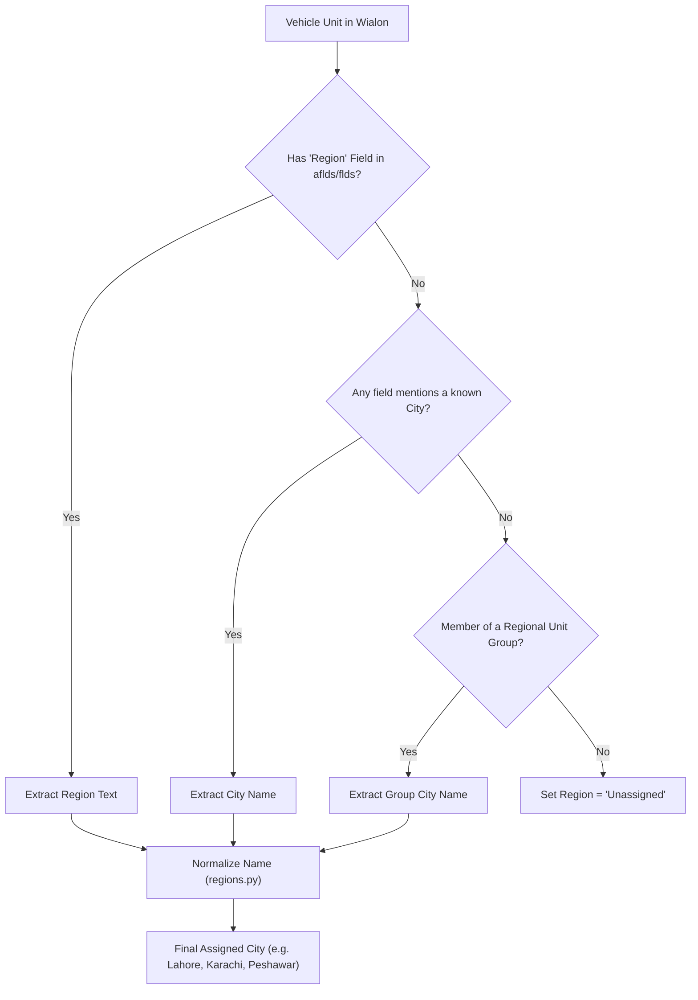

# Wialon Remote API & GIS Integration Reference

This document provides a comprehensive reference of all **Wialon Remote API** services, **GIS Geocoding** endpoints, and data extraction pipelines used across the **Wialon Fleet Operations & Compliance Portal**.

---

## 1. Summary of API Services Used

| Service / Endpoint | Method | Primary Purpose | Code Location |
| :--- | :--- | :--- | :--- |
| `token/login` | GET / POST | Authenticates session token, generates session IDs (`sid`, `gis_sid`). | `app.py`, `wialon_alerts.py`, `reports.py` |
| `core/logout` | GET / POST | Terminates sessions and frees API worker slots. | `wialon_alerts.py`, `reports.py` |
| `core/search_items` (`avl_unit`) | POST | Fetches live vehicle fleet status (GPS, speed, ignition `io_239`, mileage). | `app.py`, `reports.py`, `regions.py` |
| `core/search_items` (`avl_resource`) | POST | Fetches driver directory (`drvrs`) and vehicle assignment bindings. | `app.py`, `reports.py` |
| `core/search_items` (`avl_unit_group`) | POST | Fetches fleet unit groups (e.g. `Unilever`, regional hubs) to filter scope. | `reports.py`, `regions.py` |
| `core/batch` | POST | Bundles multiple telemetry / message calls into a single HTTP round-trip. | `fleet_violations.py`, `reports.py`, `wialon_alerts.py` |
| `messages/load_interval` | POST | Loads raw GPS and sensor messages into server-side buffer for a time window. | `fleet_violations.py`, `reports.py`, `wialon_alerts.py` |
| `messages/get_messages` | POST | Downloads filtered telemetry points (`pos.s`, `pos.x`, `pos.y`, `p.io_239`). | `fleet_violations.py`, `reports.py` |
| `messages/unload` | POST | Cleans up and frees server memory after telemetry extraction. | `fleet_violations.py`, `reports.py` |
| `report/exec_report` | POST | Runs server-side Wialon reports (Trips shortlist, alert summaries). | `reports.py`, `wialon_alerts.py` |
| `report/get_report_status` | POST | Polls asynchronous report calculation status (`4` = ready). | `reports.py`, `wialon_alerts.py` |
| `report/apply_report_result` | POST | Mounts computed report result for reading. | `reports.py`, `wialon_alerts.py` |
| `report/select_result_rows` | POST | Reads table rows from computed reports. | `reports.py`, `wialon_alerts.py` |
| `report/cleanup_result` | POST | Clears server-side report cache to avoid memory leaks. | `reports.py`, `wialon_alerts.py` |
| `unit/get_trip_detector` | POST | Reads tracker trip detection thresholds (e.g., `minStayTime`). | `reports.py` |
| `gis_geocode` (GIS Host) | GET / POST | Reverse-geocodes raw lat/lon to Pakistani landmarks, roads, and cities. | `app.py` |

---

## 2. Detailed Breakdown by Pipeline

### A. Authentication & Session Management
- **Endpoint**: `https://hst-api.wialon.eu/wialon/ajax.html?svc=token/login`
- **Parameters**: `{"token": WIALON_TOKEN}`
- **Usage**:
  - Obtains `eid` (Session ID `sid`).
  - Obtains `gis_sid` and `gis_geocode` URL for reverse geocoding.
  - Automatically re-authenticates if session expires (Wialon error code `1` or `4`).
- **Logout**: `https://hst-api.wialon.eu/wialon/ajax.html?svc=core/logout` with `{}` and `sid`.

---

### B. Fleet & Driver Discovery
#### 1. Live Vehicles (`avl_unit`)
- **Endpoint**: `svc=core/search_items`
- **Parameters**:
  ```json
  {
    "spec": {
      "itemsType": "avl_unit",
      "propName": "sys_name",
      "propValueMask": "*",
      "sortType": "sys_name"
    },
    "force": 1,
    "flags": 285995,
    "from": 0,
    "to": 0
  }
  ```
- **Flags**: `285995` (`0x1` base + `0x2` pos + `0x8` custom fields + `0x80` admin fields + `0x400` sensors + `0x1000` counters + `0x40000` last message).
- **Data Extracted**:
  - `nm`: Vehicle plate / registration name (e.g., `CCH-891`).
  - `pos.y`, `pos.x`: Latest Latitude / Longitude.
  - `pos.s`: Current Speed (km/h).
  - `pos.t`: Timestamp of last coordinate update.
  - `lmsg.p.io_239`: Ignition status (`1` = ON, `0` = OFF).
  - `cnm`: Odometer mileage counter.

#### 2. Live Driver Directory (`avl_resource`)
- **Endpoint**: `svc=core/search_items`
- **Parameters**:
  ```json
  {
    "spec": {
      "itemsType": "avl_resource",
      "propName": "sys_name",
      "propValueMask": "*",
      "sortType": "sys_name"
    },
    "force": 1,
    "flags": 257,
    "from": 0,
    "to": 0
  }
  ```
- **Data Extracted**: Driver directory dictionary `drvrs` with assigned vehicle unit IDs (`bu`) and driver names (`n`).

---

### C. Telemetry Stream & Fatigue Calculation Engine
To analyze driving/rest compliance over 309 vehicles without downloading gigabytes of redundant GPS data, the portal uses a high-efficiency 3-step batching pipeline:

1. **Shortlist Trips via Wialon Report**:
   - `svc=report/exec_report` executes an inline `unit_group_trips` report to find vehicles with trips exceeding threshold limits.
2. **Batch Telemetry Query (`core/batch`)**:
   - Sends grouped calls to download only the necessary sensor parameters:
   ```json
   [
     {
       "svc": "messages/load_interval",
       "params": {
         "itemId": "<unit_id>",
         "timeFrom": "<start_unix>",
         "timeTo": "<end_unix>",
         "flags": 1,
         "flagsMask": 65281,
         "loadCount": 0
       }
     },
     {
       "svc": "messages/get_messages",
       "params": {
         "indexFrom": 0,
         "indexTo": 4294967295,
         "filter": "pos.s,pos.x,pos.y,p.io_239"
       }
     },
     {
       "svc": "messages/unload",
       "params": {}
     }
   ]
   ```
3. **Execution by Fatigue Engine**:
   - Analyzes continuous driving intervals against day/night thresholds (e.g. 2.5h day, 2.0h night).
   - Filters out 1–2 second ignition flickers while preserving genuine stops (30s, 2m, 3m).

---

### D. Wialon Alert & Notification Events
- **Endpoint**: `svc=messages/load_interval`
- **Flags**: `0x0601` (`flagsMask: 0xFF01`, `loadCount: 0xFFFFFFFF`)
- **Purpose**: Directly queries historical alert messages stored in Wialon tracker logs:
  - `Night Time Driving` $\rightarrow$ `NIGHT_DRIVING`
  - `Overspeed-Highway` $\rightarrow$ `OVERSPEED_HIGHWAY`
  - `Overspeed-Motorway` $\rightarrow$ `OVERSPEED_MOTORWAY`
  - `Seat Belt ('Ignition Off - Seatbelt On')` $\rightarrow$ `SEAT_BELT_IGNITION_OFF`
  - `Delay Driver Seat Belt` $\rightarrow$ `DELAY_DRIVER_SEAT_BELT`
  - `Overspeed` $\rightarrow$ `OVERSPEED`

---

### E. GIS Reverse Geocoding
- **Endpoint**: `https://geocode-maps.wialon.com/gis_geocode`
- **Query Parameters**: `coords=[{"lat": 31.52, "lon": 74.35}]&flags=1255211&uid=<UID>&gis_sid=<GIS_SID>`
- **Output**: Resolves coordinates into street names, highway corridors, cities, and landmarks (e.g., *M-2 Motorway / Pindi Bhattian*, *Multan Road, Lahore*).

---

## 3. Vehicle Region Extraction Architecture

Vehicle region represents a vehicle's **home depot or operational base** in Wialon, resolved through a 3-tier hierarchy in `regions.py`:



### Normalization Logic:
- `WPS/Foods Factory Lahore` $\rightarrow$ **`Lahore`**
- `Peshawar/Islamabad` $\rightarrow$ **`Peshawar`**
- Urdu names (`لاہور`, `کراچی`, `پشاور`, `ملتان`) $\rightarrow$ **`Lahore`, `Karachi`, `Peshawar`, `Multan`**
